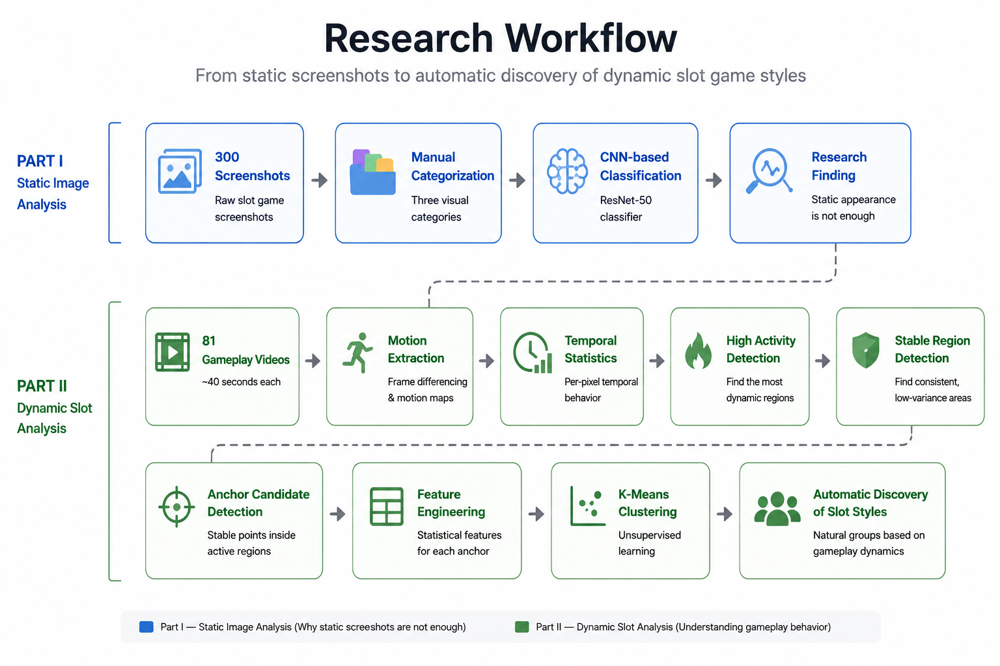
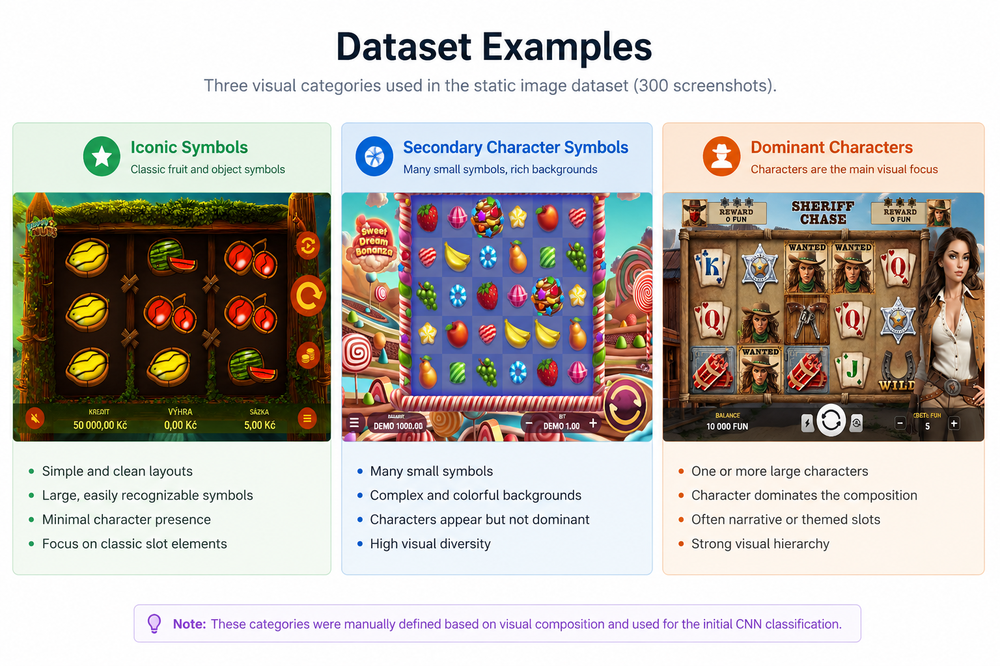
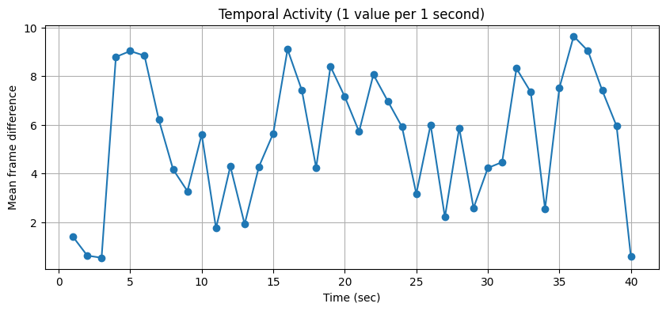
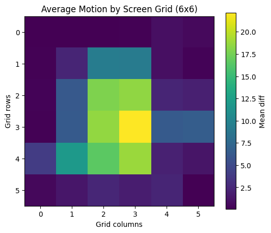
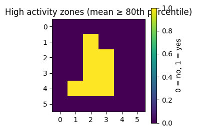
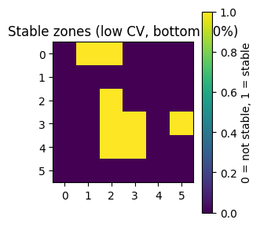
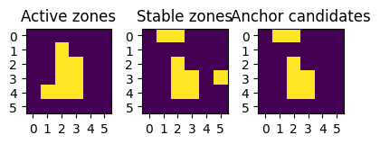
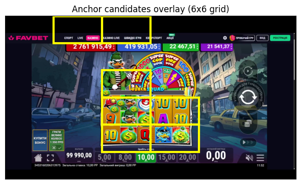
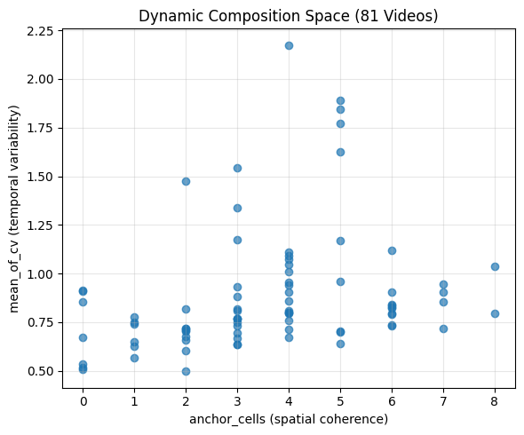
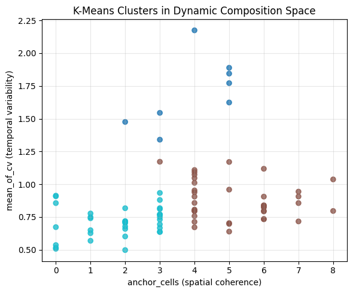

# 🎰 Slot Style Classifier

### AI-based Dynamic Slot Style Analysis using Computer Vision and Unsupervised Learning

## 📖 Project Overview

This project explores whether slot games can be categorized automatically based on their visual composition and motion dynamics.

Unlike traditional image classification, this project analyzes both static screenshots and gameplay videos to extract spatial and temporal behavioral patterns.

The final stage applies unsupervised machine learning (K-Means clustering) to discover natural groups of slot games without using predefined labels.

## 🎯 Motivation

Traditional slot classification is usually based on static screenshots or manually defined categories.

However, player perception depends not only on visual appearance but also on how different screen regions behave over time.

The objective of this project is to measure gameplay dynamics automatically and identify recurring composition patterns using computer vision and machine learning.

# ⚙️ Research Workflow

<p align="center">
    
</p>


# 📂 Project Structure

slot_style_classifier/
│
├── data/
│   ├── processed_3styles/          # 300 preprocessed screenshots
│   │   ├── Dominant_Characters/
│   │   ├── Iconic_Symbols/
│   │   └── Secondary_Character_Symbols/
│   │
│   └── videos/                     # 81 gameplay recordings
│
├── images/                         # Figures used in README
│
├── notebooks/
│   ├── 01_dataset_check.ipynb
│   ├── slot_style_classifier_new.ipynb
│   └── slot_style_dynamic.ipynb
│
├── README.md
├── requirements.txt
└── .gitignore

# 📊 Dataset

The project consists of two independent datasets.

### Example Dataset

The following figure illustrates the three manually defined visual categories used during the first stage of the research.

<p align="center">
    
</p>


### Static Images

The static dataset contains manually collected slot screenshots organized into three visual categories for supervised image classification.

- 303 slot screenshots
- Cropped and cleaned
- Grouped into three manually defined visual categories:
  - Dominant Characters
  - Iconic Symbols
  - Secondary Character Symbols


### Gameplay Videos

- 81 gameplay recordings
- Approximately 40 seconds each
- Used to analyze temporal behavior instead of static appearance

# 🖼️ Part I — Static Image Analysis

The first stage of the project explored whether slot games can be classified using only static screenshots.

The dataset was manually organized into three visual categories.

A CNN classifier was trained to distinguish these categories automatically.

Although the model achieved reasonable accuracy, qualitative analysis showed that many slot games share similar visual layouts while behaving very differently during gameplay.

This motivated the transition from image classification to dynamic video analysis.

<p align="center">
    
</p>


# 🎥 Part II — Dynamic Slot Analysis

Instead of analyzing appearance, the second stage focused on gameplay dynamics.

Each gameplay recording was sampled over time.

Motion maps were computed for every sampled frame and aggregated into spatial-temporal statistics.

The objective was to discover recurring gameplay structures rather than predefined visual classes.

<p align="center">
    
</p>

*Average motion intensity aggregated over all gameplay videos. Brighter regions indicate higher motion frequency.*

### High Activity Detection

To identify the most dynamic parts of the screen, the average motion map was thresholded using the 80th percentile.

Only the most active grid cells were retained for further analysis.

<p align="center">
    
</p>

*High activity regions extracted from the average motion map.*

These regions represent the most dynamic parts of the gameplay and serve as the basis for identifying stable anchor locations.


### Stable Region Detection

Not all highly active regions are equally informative.

To identify persistent gameplay structures, the coefficient of variation (CV) was used to detect regions with stable motion patterns.

<p align="center">
    
</p>

*Stable regions identified using the lowest coefficient of variation (CV).*

### Anchor Candidate Detection

The intersection of highly active and temporally stable regions defines the anchor candidates.

These regions are hypothesized to represent visually important gameplay elements that consistently attract player attention.

<p align="center">
    
</p>

*Anchor candidates obtained by combining high activity and temporal stability.*

This feature engineering step transforms raw motion maps into compact descriptors that can be used for clustering.


# 📈 Results
The extracted dynamic features were used to represent each gameplay video in a low-dimensional feature space.

This enabled the exploration of structural similarities between slot games without relying on predefined labels.

<p align="center">
    
</p>

*Anchor candidates projected back onto the original gameplay screen.*


### Dynamic Feature Space

Each gameplay video is represented by a compact feature vector describing its spatial and temporal behavior.

Projecting these features into a two-dimensional space reveals how different slot games relate to one another before clustering.

<p align="center">
    
</p>

*Dynamic feature space representing all gameplay videos before clustering.*


### K-Means Clustering

The extracted features were clustered using the K-Means algorithm.

Three naturally occurring groups emerged, representing different dynamic gameplay compositions.

<p align="center">
    
</p>

*Three automatically discovered gameplay clusters in the dynamic feature space.*


## Conclusion

This project demonstrates that static screenshots alone are insufficient to characterize slot game behavior.

By incorporating temporal information extracted from gameplay videos, it becomes possible to identify meaningful dynamic patterns and automatically group games based on their visual behavior.


# 🛠 Technologies

- Python
- OpenCV
- NumPy
- Pandas
- Matplotlib
- SciPy
- Scikit-learn
- Jupyter Notebook


# 📓 Notebooks

The repository contains three Jupyter notebooks:

| Notebook | Description |
|---|---|
| [`01_dataset_check.ipynb`](notebooks/01_dataset_check.ipynb) | Dataset validation and preprocessing |
| [`slot_style_classifier_new.ipynb`](notebooks/slot_style_classifier_new.ipynb) | Static image analysis and CNN classification |
| [`slot_style_dynamic.ipynb`](notebooks/slot_style_dynamic.ipynb) | Dynamic video analysis and K-Means clustering |


# 🚀 Installation

Clone the repository:

```bash
git clone https://github.com/YermakPetr/slot-style-classifier.git
```

Install the required packages:

```bash
pip install -r requirements.txt
```

Open the notebooks:

```bash
jupyter notebook
